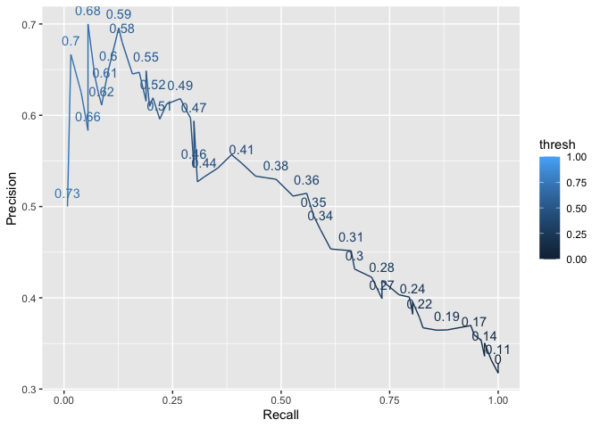

ProbabilisticAUC
================

Probabilistic AUC
-----------------

The Probabilistic interpretation of AUC is the probability the model will score a randomly chosen positive class higher than a randomly chosen negative class. Lets check this out!

Getting data
------------

``` r
#Lets us UCLA data set. Build a simple prediction model with "admit" as dependent variable
df <- read.csv("https://stats.idre.ucla.edu/stat/data/binary.csv")
```

Quick data exploration
----------------------

``` r
df <- df %>% 
  mutate(rank = as.factor(rank))

df %>% 
  summarise_each(list(na = ~sum(is.na(.)))) 
```

    ##   admit_na gre_na gpa_na rank_na
    ## 1        0      0      0       0

No NAs

Numeric variables
-----------------

``` r
df %>% 
  summarise_if(is.numeric, mean)
```

    ##    admit   gre    gpa
    ## 1 0.3175 587.7 3.3899

We have ~ 30/70 split between positive and negative class (admit).

Simple prediction model
-----------------------

``` r
## Skipping train/test split. At this point we are only interested in the characteristics of AUC. 
model  <- glm(admit ~ .,data  = df, family = binomial)

model %>% 
  summary()
```

    ## 
    ## Call:
    ## glm(formula = admit ~ ., family = binomial, data = df)
    ## 
    ## Deviance Residuals: 
    ##     Min       1Q   Median       3Q      Max  
    ## -1.6268  -0.8662  -0.6388   1.1490   2.0790  
    ## 
    ## Coefficients:
    ##              Estimate Std. Error z value Pr(>|z|)    
    ## (Intercept) -3.989979   1.139951  -3.500 0.000465 ***
    ## gre          0.002264   0.001094   2.070 0.038465 *  
    ## gpa          0.804038   0.331819   2.423 0.015388 *  
    ## rank2       -0.675443   0.316490  -2.134 0.032829 *  
    ## rank3       -1.340204   0.345306  -3.881 0.000104 ***
    ## rank4       -1.551464   0.417832  -3.713 0.000205 ***
    ## ---
    ## Signif. codes:  0 '***' 0.001 '**' 0.01 '*' 0.05 '.' 0.1 ' ' 1
    ## 
    ## (Dispersion parameter for binomial family taken to be 1)
    ## 
    ##     Null deviance: 499.98  on 399  degrees of freedom
    ## Residual deviance: 458.52  on 394  degrees of freedom
    ## AIC: 470.52
    ## 
    ## Number of Fisher Scoring iterations: 4

``` r
#Get fitted values
df$prediction = predict(model, newdata = df, type="response")
#Check the AUC by using exciting packgae
library(precrec)
precrec_obj <- evalmod(scores = df$prediction, labels = df$admit)


auc(precrec_obj)
```

    ##   modnames dsids curvetypes      aucs
    ## 1       m1     1        ROC 0.6928413
    ## 2       m1     1        PRC 0.5087611

AUC is 0.6928.

``` r
# Create to vectors, postive case and negative cases

pred_positive <- df %>%
   filter(admit == 1) %>% 
  pull(prediction)

pred_negative <- df %>%
   filter(admit == 0) %>% 
  pull(prediction)
```

``` r
#Set sample size 
set.seed(1999)
n <- 10000

# Take a sample of size n of both postive  and negative cases, check if positive has higher predicted value, and take the average of all n cases

mean(sample(pred_positive, n, replace = TRUE) > sample(pred_negative, n, replace = TRUE))
```

    ## [1] 0.6912

So, we are quite close to the actual AUC.

Plotting ROC
------------

``` r
## Create a data frame with TPR/FPT and precision 
threshold <- seq(0, 1, by = 0.01)

## Get the false positive rate 
false_postitve_rate <- sapply(threshold,
  function(thresh) {
    sum(df$prediction >= thresh & df$admit != 1) / sum(df$admit != 1)
  })

#Recall/true positive rate
true_positive_rate <- sapply(threshold,
  function(thresh) {
    sum(df$prediction >= thresh & df$admit == 1) / sum(df$admit == 1)
  })

# Get precison
Precision <-  sapply(threshold,
                   function(thresh) {
    sum(df$prediction >= thresh & df$admit == 1) / sum(df$prediction >= thresh)
  })


df_auc <- data.frame("thresh" = threshold,
                     "TPR" = true_positive_rate,
                     "FPR" = false_postitve_rate,
                     "Precison" = Precision)
```

``` r
df_auc %>% 
  ggplot(aes(x = false_postitve_rate, y = true_positive_rate, label = thresh, color = thresh)) +
  geom_point() +
  geom_text(check_overlap = TRUE, vjust = -1) +
  labs(y = "True Positive rate", x = "Fasle Positive Rate")
```


Precision/Recall Tradeoff
-------------------------

``` r
df_auc %>% 
  ggplot(aes(x = true_positive_rate, y = Precision, label = thresh, color = thresh)) +
  geom_line(aes(group =1 )) +
  geom_text(check_overlap = TRUE, vjust = -1) +
  labs(y = "Precision", x = "Recall")
```



Metrics vs Threshold
--------------------

``` r
df_auc %>% 
  gather(key, metric, -thresh) %>% 
  ggplot(aes(x = thresh, y = metric,color = key)) +
  geom_line() +
  geom_vline(xintercept = mean(df$admit), linetype = "dashed") +
  labs(y = "Metric", x = "Threshold")  +
  theme(legend.position = "top",
        legend.title = element_blank()) 
```


